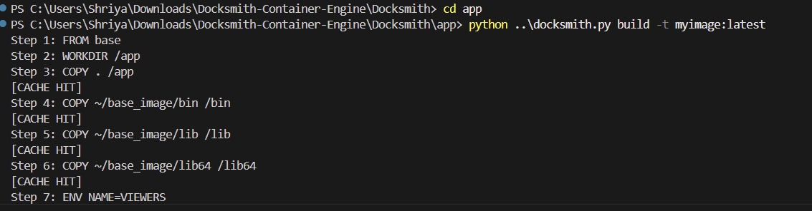
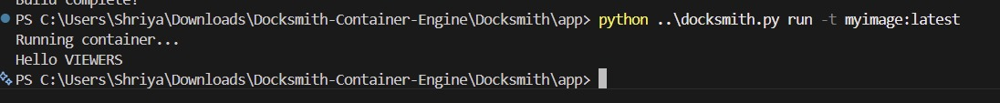
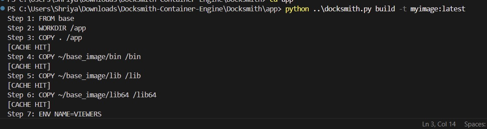
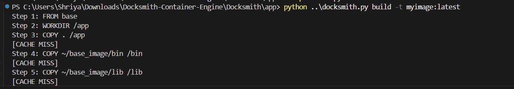
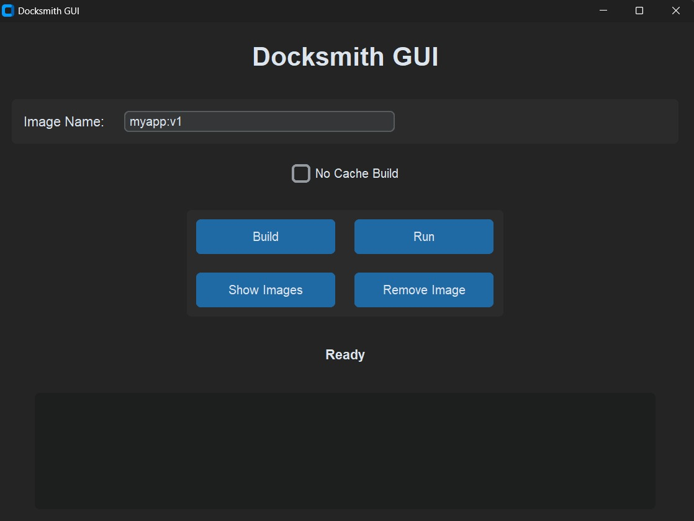

# Docksmith - Lightweight Container Build Engine

A lightweight Docker-inspired container engine with layer caching, runtime execution, and GUI-based container operations implemented in Python.

---

## Features

* Dockerfile-style build system
* Layer caching mechanism
* Cache hit and cache miss detection
* Runtime container execution
* Environment variable support
* COPY, RUN, CMD, ENV instruction handling
* CustomTkinter GUI
* Command Line Interface (CLI) support
* Lightweight container simulation

---

## Supported Instructions

| Instruction | Description                   |
| ----------- | ----------------------------- |
| FROM        | Base image setup              |
| WORKDIR     | Set working directory         |
| COPY        | Copy files and folders        |
| ENV         | Set environment variables     |
| RUN         | Execute commands during build |
| CMD         | Execute runtime commands      |

---

## Tech Stack

* Python
* CustomTkinter
* File System Operations
* Hash-based Layer Caching
* CLI Architecture

---
## Demo Video


https://github.com/user-attachments/assets/f0b54169-949d-417b-9333-d2f105aa9570


## Project Workflow

### Build Process

```bash
python docksmith.py build -t myimage:latest
```

## Build Process Preview



---

### Run Container

```bash
python docksmith.py run -t myimage:latest
```

## Runtime Execution



---

## Cache Mechanism

Docksmith implements layer-based caching similar to Docker.

### Cache Behavior

* Unchanged layers → CACHE HIT
* Modified layers → CACHE MISS

This improves build performance by avoiding redundant operations and rebuilds.

---

## Cache HIT Example



---

## Cache MISS Example



---

## GUI Interface

Run GUI using:

```bash
python gui.py
```

### GUI Features

* Build execution
* Runtime execution
* Cache visualization
* Interactive container operations

---

## GUI Preview



---

## Example Output

```text
Step 1: FROM base
Step 2: WORKDIR /app
Step 3: COPY . /app
[CACHE HIT]
Step 4: ENV NAME=VIEWERS
Step 5: CMD ["python", "/app/main.py"]
Build complete!
```

---
## Architecture

The project is divided into multiple modules:

- `builder.py` → Handles image build workflow and instruction parsing
- `runtime.py` → Executes runtime container operations
- `docksmith.py` → Main CLI entry point
- `gui.py` → GUI interface using CustomTkinter
- `utils.py` → Utility/helper functions
- `app/` → Sample containerized application and Docksmithfile

## Future Improvements

* Multi-container support
* Network simulation
* Volume mounting
* Image registry system
* Container isolation improvements
* Linux namespace integration

---

## Author

Shriya Shetty
